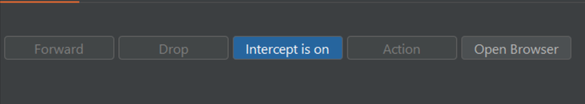
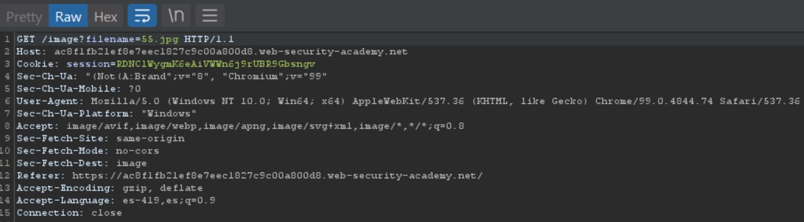
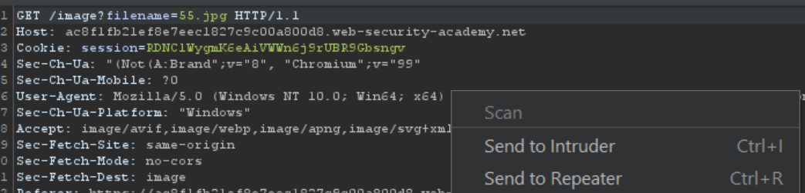
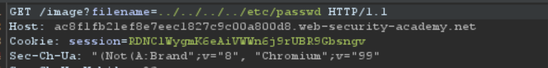
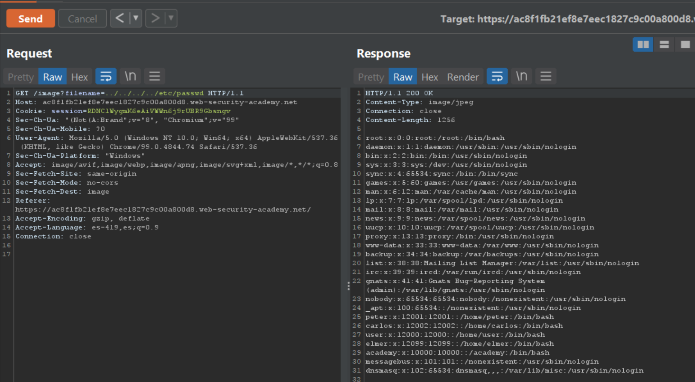
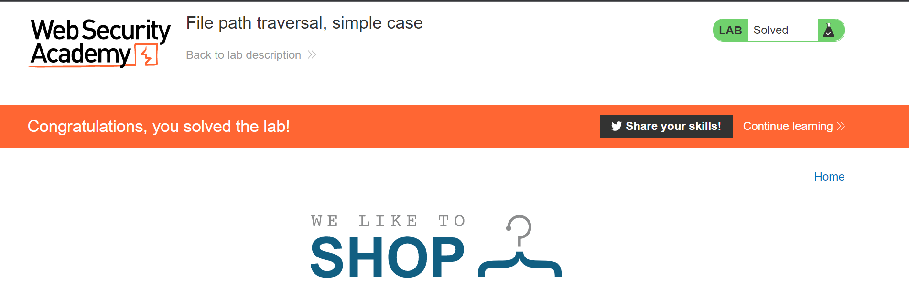

# Directory Traversal

---


## Blind OS command injection vulnerabilities

Directory traversal (also known as file path traversal) is a web security vulnerability that allows an attacker to read arbitrary files on the server that is running an application. This might include application code and data, credentials for back-end systems, and sensitive operating system files. In some cases, an attacker might be able to write to arbitrary files on the server, allowing them to modify application data or behavior, and ultimately take full control of the server.

## Resolving the lab

First open your Burp Suite Tool


Now open your account in the section Directory Transversal


Start your lab "Access de lab"

Then you will se some like this one


Now the lab say :

This lab contains a file path traversal vulnerability in the display of product images.

To solve the lab, retrieve the contents of the /etc/passwd file.

To resolv this lab we need to find where the web server call de resources, for example the images, the images are stored in some place of the server usualy in the folder __/var/www/img__ or __/var/www/img__

Now we can refresh our web browser, after to do this we need to have our __intercept on__



Now refresh our website.

Perfect we can see the request of website



Now send the request to __Repeater__ 



Now look at the request anatomy 

```bash
GET /image?filename=55.jpg HTTP/1.1
Host: ac8f1fb21ef8e7eec1827c9c00a800d8.web-security-academy.net
Cookie: session=RDNClWygmK6eAiVWWn6j9rUBR9Gbsngv
Sec-Ch-Ua: "(Not(A:Brand";v="8", "Chromium";v="99"
Sec-Ch-Ua-Mobile: ?0
User-Agent: Mozilla/5.0 (Windows NT 10.0; Win64; x64) AppleWebKit/537.36 (KHTML, like Gecko) Chrome/99.0.4844.74 Safari/537.36
Sec-Ch-Ua-Platform: "Windows"
Accept: image/avif,image/webp,image/apng,image/svg+xml,image/*,*/*;q=0.8
Sec-Fetch-Site: same-origin
Sec-Fetch-Mode: no-cors
Sec-Fetch-Dest: image
Referer: https://ac8f1fb21ef8e7eec1827c9c00a800d8.web-security-academy.net/
Accept-Encoding: gzip, deflate
Accept-Language: es-419,es;q=0.9
Connection: close
```

The most important of this request is the line number 1 where the mothod was set __GET__

```bash
GET /image?filename=55.jpg HTTP/1.1
```

Here the server are looking the resource __55.png__, but there is a function __filename__ where we can try to retrive the file /passwd where are stored the credential and useres

To try to exploit this vulnerability we need a payload

list of the awesome payloads: https://github.com/omurugur/Path_Travelsal_Payload_List

the payload we will use is:

```bash
../../../../etc/paswd
```

First of all off your intercept to avoid problems with the request.

Now modify your header and press __Send__:



```bash
GET /image?filename=../../../../etc/paswd HTTP/1.1
```

Finally we can see how the server respond with the file.



