# OS Command Injection Lab 02

---

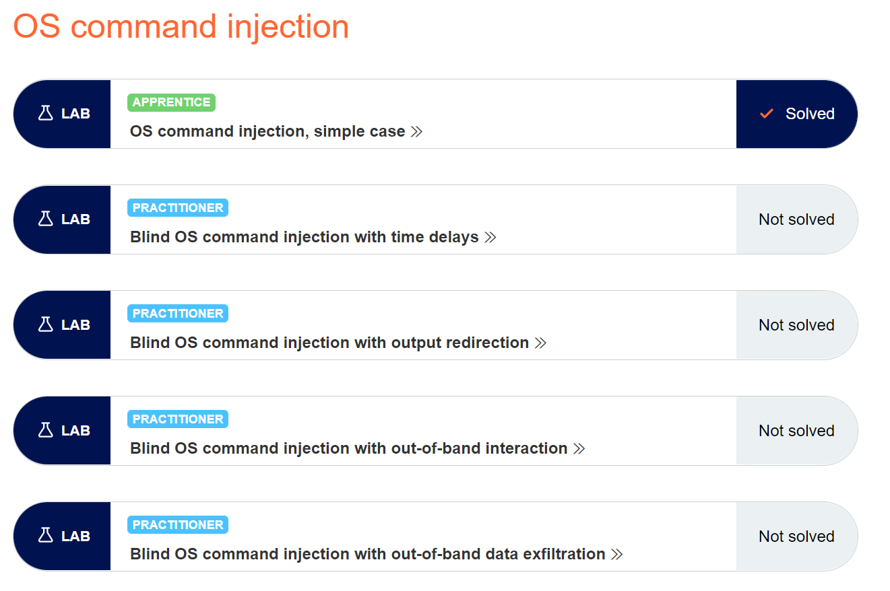

## Blind OS command injection vulnerabilities

Many instances of OS command injection are blind vulnerabilities. This means that the application does not return the output from the command within its HTTP response. Blind vulnerabilities can still be exploited, but different techniques are required.

Consider a web site that lets users submit feedback about the site. The user enters their email address and feedback message. The server-side application then generates an email to a site administrator containing the feedback. To do this, it calls out to the mail program with the submitted details. For example:

`mail -s "This site is great" -aFrom:peter@normal-user.net feedback@vulnerable-website.com`

## Resolving the lab

First open your Burp Suite Tool

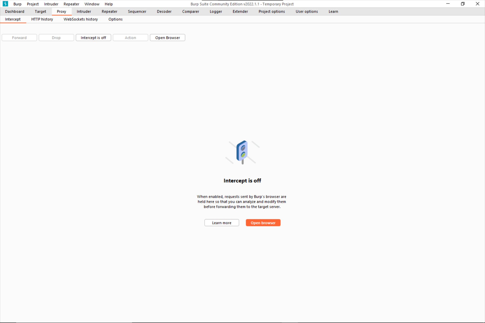

Now open your account in the section OS Command Injection

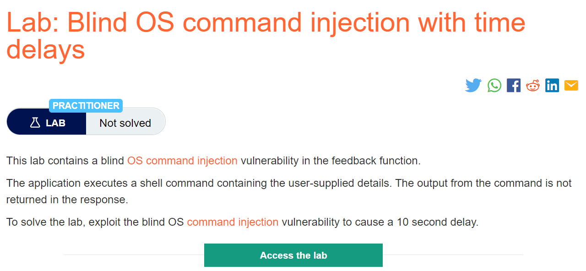

Start your lab "Access de lab"

Then you will se some like this one

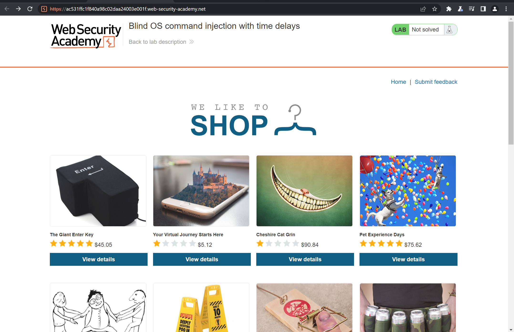

Now the lab say :

This lab contains a blind OS command injection vulnerability in the feedback function.

The application executes a shell command containing the user-supplied details. The output from the command is not returned in the response.

To solve the lab, exploit the blind OS command injection vulnerability to cause a 10 second delay.

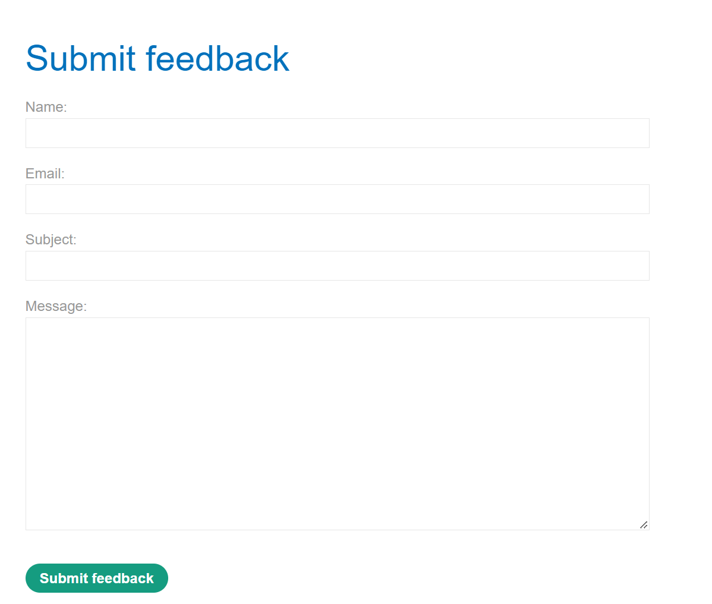

We can see a form where we can put or fill all information and send it the form through burp suite

Now fill in all the fields and before to send the data in the burp suite press '__intercept is off__' to enable the intercept

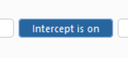

and finally press '__Submit feddback__' in the form, we can see how burp suite show us the information about the request and we can see the information that we previously filled

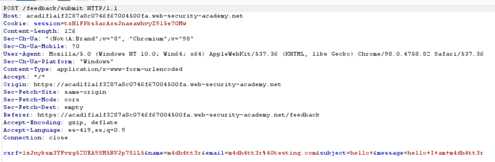

Where we should look the vulnerability is in the request where are putted the data

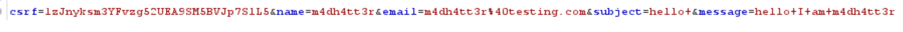

Now right clic and send the request to __Repeater__

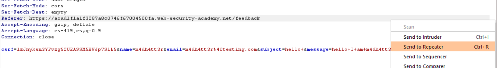

Now off the intercept to avoid poroblems with the next request.

Once in the request we gonna modify the parameters

first of all we need encode the following characters __||__ to put into the __email__ parameters.

To do this we press in the tab Decoder
write __||__ and in the bar press __encode as__ __url__ 

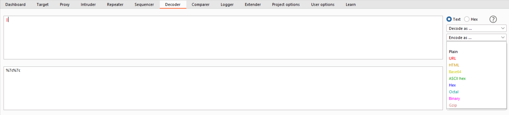

Now in the parameter __email__ set the follwing line  __%7c%7cping+-c+10+127.0.0.1%7c%7c__ where __"%7c = |"__ in decode mode all are equals to __" ||ping+-c+10+127.0.0.1|| "__

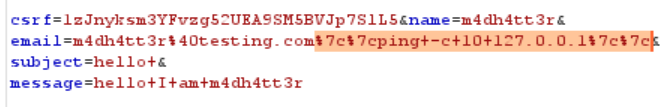

Now send the request and we can see how the web server slow to respond.

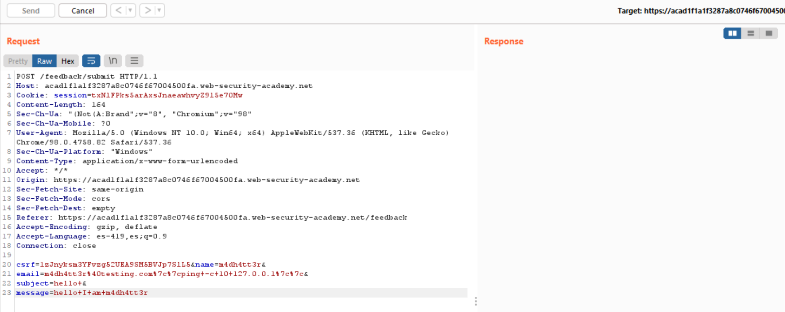

And finally the lab was solved

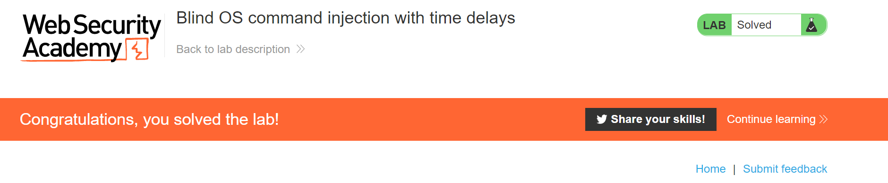
